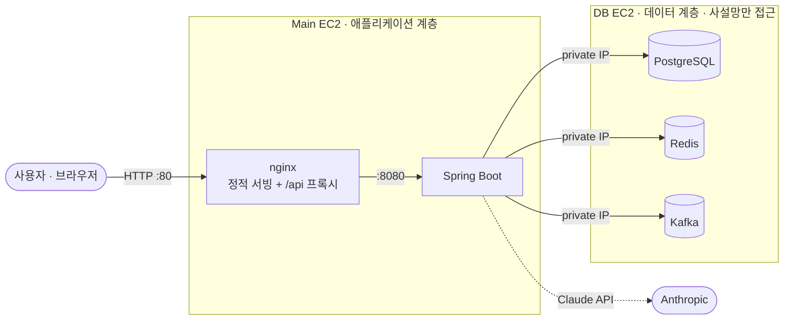
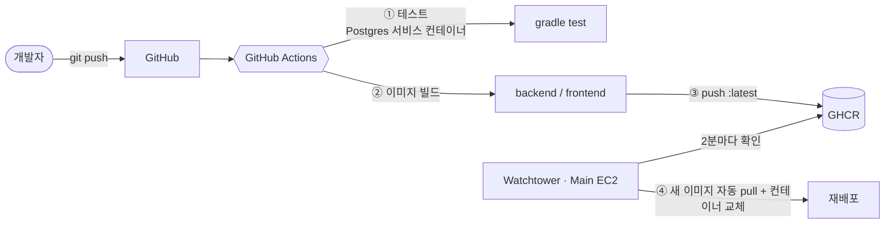

# codeXray

> 알고리즘 문제풀이 기록과 **AI 코드 분석**을 한곳에서 — 내 풀이를 X-ray 하듯 들여다보는 학습 플랫폼

codeXray는 알고리즘 문제를 풀고, 풀이·메모·노트를 남기고, **Claude 기반 AI로 내 코드를 분석/힌트**받으며, 커뮤니티에서 함께 성장하는 서비스입니다. 웹과 **브라우저 확장** 두 클라이언트를 지원하며, GitHub Actions → GHCR → AWS EC2로 이어지는 **CI/CD 파이프라인 위에서 컨테이너로 배포**됩니다.

---

## 📚 목차
- [주요 기능](#-주요-기능)
- [기술 스택](#-기술-스택)
- [시스템 아키텍처](#-시스템-아키텍처)
- [CI/CD & 배포](#-cicd--배포)
- [성능 최적화](#-성능-최적화)
- [기술적 의사결정](#-기술적-의사결정)
- [로컬 실행](#-로컬-실행)
- [프로젝트 구조](#-프로젝트-구조)

---

## ✨ 주요 기능

| 도메인 | 내용 |
|---|---|
| **인증** | 이메일 회원가입·인증메일, 로그인/로그아웃, JWT(access) + refresh 토큰 **회전(rotation)**, 소셜 로그인(Google/Naver) |
| **문제** | 문제 목록(태그·난이도·출처 필터, 페이징), 상세 조회 — QueryDSL 동적 쿼리 |
| **풀이/기록** | 풀이 제출·조회, 풀이별 메모, 개인 노트 |
| **AI 분석** | 풀이 코드 분석 & 문제 힌트를 **Claude로 생성** — Kafka 비동기 처리 + 잡 폴링, 사용자별 일일 사용량 제한 |
| **커뮤니티** | 게시글·댓글·추천(투표)·신고 |
| **알림** | 활동 기반 알림 |
| **대시보드** | 개인 학습 통계, 문제 추천 |
| **체감 난이도** | 사용자 피드백 기반 난이도 보정 |
| **운영** | 관리자용 스케줄러/배치 잡 |

멀티 클라이언트: **웹**은 refresh 토큰을 httpOnly 쿠키로, **브라우저 확장**은 쿠키를 못 쓰므로 헤더/바디로 토큰을 주고받도록 인증 계층을 분기 처리했습니다.

---

## 🛠 기술 스택

**Backend**
- Java 21, Spring Boot 4.1
- Spring Security + JWT(jjwt), Spring Data JPA(Hibernate), QueryDSL
- PostgreSQL, Redis(refresh 토큰 저장소 + Spring Cache 조회 캐시), Apache Kafka(AI 비동기)
- QueryDSL 동적 쿼리, `@BatchSize` N+1 최적화
- Flyway(마이그레이션 + 시드), Spring Mail(이메일 인증)
- Anthropic Java SDK(Claude)

**Frontend**
- React 19, TypeScript, Vite 6
- TailwindCSS 4, React Router 7, TanStack Query, Zustand, Axios
- CodeMirror(다국어 코드 에디터: C++/Java/Python/JS/Go/Rust/SQL), react-markdown(AI 결과 렌더링)

**Infra / DevOps**
- Docker(멀티 스테이지 빌드), nginx(정적 서빙 + 리버스 프록시)
- GitHub Actions(CI/CD), GHCR(이미지 레지스트리), Watchtower(자동배포)
- AWS EC2 ×2 (애플리케이션 계층 / 데이터 계층 분리)

---

## 🏗 시스템 아키텍처

애플리케이션 계층(**Main EC2**)과 데이터 계층(**DB EC2**)을 분리하고, 둘은 같은 VPC의 **사설망(private IP)** 으로만 통신합니다. 외부에는 웹(80) 포트만 열려 있습니다.



- **same-origin 구조**: nginx가 React 정적파일을 서빙하고 `/api` 요청만 백엔드로 프록시 → 프론트·백엔드가 동일 오리진이라 **CORS가 불필요**하고 쿠키 인증이 단순해집니다.
- **계층 분리**: 상태를 갖는 저장소(PG/Redis/Kafka)를 별도 EC2로 격리 → Main은 stateless, 확장·교체가 쉬움.
- **AI 비동기**: 느린 LLM 호출을 요청-응답 흐름에서 떼어내 Kafka로 처리 → 사용자는 즉시 잡 ID를 받고 결과를 폴링.

---

## 🚀 CI/CD & 배포

`git push` 한 번이면 **테스트 → 이미지 빌드 → 레지스트리 푸시 → 서버 자동 반영**까지 전 과정이 자동으로 실행됩니다.



**① CI — 빌드 & 테스트** (`.github/workflows/ci.yml`)
- push/PR마다 실행. 앱 컨텍스트를 실제로 부팅하는 통합 테스트를 위해 **Postgres 서비스 컨테이너**를 띄우고, 부팅에 필요한 환경변수를 주입해 검증합니다.

**② CD — 이미지 빌드 & 푸시**
- 테스트 통과 시에만(`needs`) backend·frontend 이미지를 **멀티 스테이지**로 빌드해 GHCR에 `:latest` + 커밋 SHA 태그로 푸시합니다.

**③ 자동배포 — Watchtower(pull 방식)**
- Main EC2의 Watchtower가 GHCR을 주기적으로 확인하다가 `:latest` 다이제스트가 바뀌면 **스스로 pull 후 컨테이너를 교체**합니다.
- 서버로 들어오는 SSH inbound 없이 **outbound만으로** 배포가 이뤄져, SSH를 운영자 IP로 잠근 상태를 유지할 수 있습니다.

> **왜 push(SSH) 방식이 아니라 pull(Watchtower)인가?**
> 보안그룹에서 SSH(22)를 운영자 IP로 제한했기 때문에, 매번 IP가 바뀌는 GitHub Actions 러너가 서버로 SSH하려면 포트를 사실상 전체 개방해야 합니다. 이는 방금 세운 보안 원칙과 충돌합니다. Watchtower는 서버가 능동적으로 이미지를 가져오는 구조라 **포트를 열지 않고도** 자동배포가 가능해, 보안·비용·메모리 측면에서 이 프로젝트 규모에 가장 적합했습니다.

**보안그룹(방화벽) 설계**
- 데이터 계층 포트(5432/6379/9092)는 **보안그룹 자기 참조(self-reference)** 로만 허용 → 같은 보안그룹의 인스턴스(=Main)에서만 접근 가능, 인터넷에서 DB 직접 접근 차단.
- 웹(80)만 공개, SSH(22)는 운영자 IP로 제한.

---

## ⚡ 성능 최적화

문제 목록 조회를 **① 쿼리 최적화 → ② 캐싱** 2단계로 개선하고, 각 단계를 부하 테스트로 나눠 측정했습니다.

**문제 — N+1 쿼리**
목록 응답은 각 문제의 태그를 매핑하는데, `ProblemTag → AlgorithmTag` 연관이 지연 로딩이라 **태그를 하나씩 개별 조회**했습니다. 한 페이지(50문제)에 `select … from algorithm_tags where id=?` 가 수백 번 발생.

**① 근본 해결 — `@BatchSize`**
`AlgorithmTag`에 `@BatchSize(100)`를 적용해 개별 조회를 **`id = ANY(?)` 배치 조회 2회로** 축소(SQL 로그로 확인). **캐시 없이도 N+1이 사라집니다.**

**② 반복 조회 캐싱 — Redis `@Cacheable`**
자주 읽고 거의 안 바뀌는 목록/상세·태그를 Redis에 캐싱해, 반복 요청은 DB 조회 자체를 생략.

**부하 테스트(k6) 결과**
> 조건: 로컬 단일 머신, k6 컨테이너(`--network host`), 50 VU · think-time 0(포화) · 30초. 데이터 689문제 / 858 문제-태그 / 25 태그.

| 단계 | 처리량 | p95 | 원본 대비 |
|---|---|---|---|
| ① 원본 (N+1) | 1,662 req/s | 51.9 ms | 1.0× |
| ② `@BatchSize` (캐시 X) | 3,380 req/s | 29.2 ms | **2.0×** |
| ③ `@BatchSize` + 캐시 | 15,838 req/s | 5.8 ms | **9.5×** |

→ **쿼리 최적화만으로 2.0배**, 여기에 **캐시를 얹어 추가 4.7배(누적 9.5배)**. 캐시 미스(재시작·evict·TTL 만료) 상황에서도 ②단계 최적화가 남아 **원본으로 회귀하지 않는 것**이 핵심.

**실행계획(EXPLAIN) 확인**
메인 검색 쿼리를 `EXPLAIN ANALYZE`로 본 결과, 현재 규모(689행)에선 PostgreSQL이 **Seq Scan + Hash Join**을 선택(0.2~0.5ms)합니다. 이 크기에선 tier/source/created_at 인덱스를 추가해도 플래너가 쓰지 않아 이득이 없어, 실질 병목인 **라운드트립(N+1)** 을 먼저 잡았습니다. (수십만 행 규모가 되면 인덱스를 재검토.)

**무효화 전략 — 데이터 성격에 맞게 분리**
- **문제 상세**: 체감난이도 피드백으로 그 문제의 tier가 바뀔 때 **해당 키만 정밀 무효화**(`@CacheEvict(key=…)`).
- **문제 목록**: 어떤 필터·페이지 키가 영향받는지 특정 불가 → **전체 무효화(`allEntries`)** + 30분 TTL 안전망.
- **태그 목록**: 런타임에 바뀌지 않는 참조 데이터 → **TTL(1시간)만** 으로 관리.

**그 밖의 설계 포인트**
- **조건부 캐싱**: 자유 검색어(`keyword`)가 있는 요청은 키 조합이 사실상 무한해 히트율이 낮고 메모리만 잠식하므로 캐싱에서 제외하고, 반복이 잦은 browse/필터 조회만 캐싱합니다.
- 값 직렬화는 **JSON**(`GenericJackson2Json`)으로 두어 언어 중립적이고 `redis-cli`로 값 확인이 쉽습니다.

> 로컬(단일 머신·소량 데이터) 기준 수치입니다. 애플리케이션과 DB가 분리된 실제 배포에선 쿼리마다 네트워크 왕복이 더해져 N+1 제거·캐시 효과가 더 커집니다.

---

## 💡 기술적 의사결정

프로젝트를 진행하며 고민하고 선택한 지점들입니다.

- **JWT access + refresh 회전**
  짧은 수명의 access 토큰과, Redis에 저장되고 요청 때마다 재발급되는 refresh 토큰을 분리했습니다. refresh는 웹에선 httpOnly 쿠키로 내려 XSS 탈취 위험을 낮췄습니다.

- **웹 / 브라우저 확장 동시 지원**
  쿠키를 쓸 수 없는 확장 클라이언트를 위해 `X-Client`/`X-Refresh-Token` 헤더 경로를 두어, 같은 인증 로직을 두 매체에서 재사용합니다.

- **AI 호출의 비동기화(Kafka)**
  LLM 응답은 수 초~수십 초가 걸릴 수 있어, 동기 처리 시 요청 스레드를 오래 점유합니다. 분석/힌트 요청을 이벤트로 발행하고 컨슈머가 처리하도록 하여 API는 즉시 응답하고 클라이언트는 잡 상태를 폴링합니다.

- **Flyway가 스키마를 소유, Hibernate는 검증만(`ddl-auto: validate`)**
  마이그레이션(V1~V10)으로 스키마 변경 이력을 명시적으로 관리하고, 엔티티-스키마 불일치는 부팅 시점에 잡습니다.

- **전역 예외 처리 일원화**
  `ErrorCode` enum + `BusinessException` + `@RestControllerAdvice`로 에러 응답 형식을 통일했습니다.

- **성능은 캐시부터가 아니라 쿼리부터**
  캐시로 덮기 전에 N+1을 `@BatchSize`로 근본 해결하고(캐시 미스에도 유효), 그 위에 캐싱을 얹었습니다. 각 단계를 부하 테스트로 분리 측정([성능 최적화](#-성능-최적화) 참고). 읽기 캐시는 "빠르게"보다 **"정확하게 오래되지 않게"** 를 먼저 보고, 데이터가 바뀌는 지점(피드백→tier 재계산)을 찾아 캐시별 무효화 방식을 나눴습니다. 이미 refresh 토큰용으로 쓰던 Redis를 재사용해 인프라 추가는 없었습니다.

- **배포 아키텍처의 트레이드오프**
  비용을 이유로 ALB/사설 서브넷 없이 public 서브넷 + 보안그룹만으로 격리했고, 데이터 계층을 별도 EC2로 분리했습니다. 소규모 인스턴스의 메모리 한계(예: Kafka 기본 힙)를 고려해 JVM 힙을 제한하고 swap을 구성하는 등 **제약 안에서의 안정화**를 진행했습니다.

---

## 💻 로컬 실행

**사전 준비**: JDK 21, Node 20+, Docker

**1) 데이터 인프라 기동 (Postgres / Redis / Kafka)**
```bash
cd deploy/db
cp .env.example .env   # 값 채우기 (DB_PRIVATE_IP은 localhost 로컬용으로는 127.0.0.1)
docker compose up -d
```

**2) 백엔드**
```bash
cd backend
cp .env.example .env   # DB/Redis/Kafka 접속 정보, JWT_SECRET(32자 이상) 등 채우기
./gradlew bootRun
```

**3) 프론트엔드**
```bash
cd frontend
npm install
npm run dev            # Vite dev 서버 (프록시로 백엔드 연결)
```

> `.env` 파일들은 실제 비밀값을 담으므로 커밋되지 않습니다(`.env.example`만 제공).

---

## 📁 프로젝트 구조

```
codeXray/
├── backend/                 # Spring Boot (Java 21)
│   ├── src/main/java/...     # 도메인별 패키지: auth, user, problem, solution,
│   │                         #   rating, note, community, notification, stats,
│   │                         #   recommend, ai, scheduler, common, config
│   ├── src/main/resources/
│   │   ├── application.yml
│   │   └── db/migration/     # Flyway V1~V10 (스키마 + 시드)
│   └── Dockerfile
├── frontend/                # React 19 + Vite + TS
│   ├── src/
│   ├── nginx.conf           # 정적 서빙 + /api 리버스 프록시
│   └── Dockerfile
├── deploy/
│   ├── db/                  # DB EC2용 compose (pg + redis + kafka)
│   └── main/                # Main EC2용 compose (backend + nginx + watchtower)
└── .github/workflows/
    └── ci.yml               # CI(test) + CD(build & push to GHCR)
```
